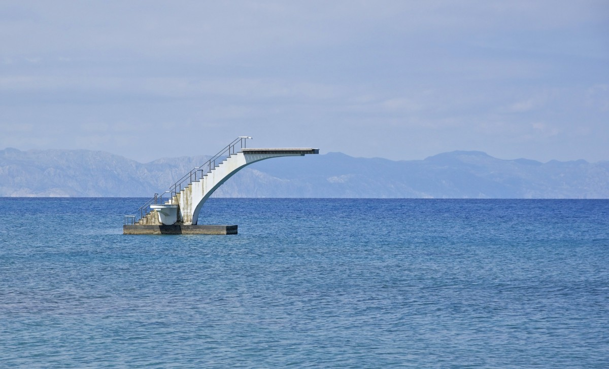
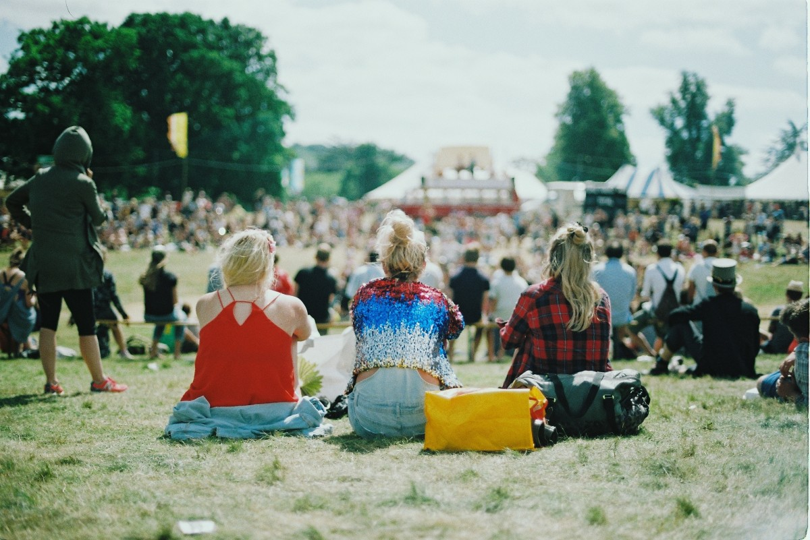
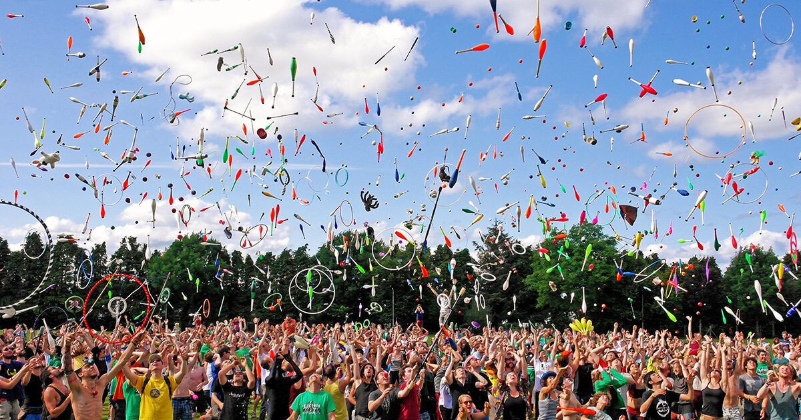

Bristol R User Group
========================================================
author: Deirdre Toher
date: 2019-08-20
autosize: true

About me
========================================================
left: 80%

- Find me [@dtoher](https://twitter.com/dtoher) or [https://people.uwe.ac.uk/Person/DeirdreToher](https://people.uwe.ac.uk/Person/DeirdreToher).
- 10 years teaching in UWE Bristol.
- (Currently) head of Mathematics and Statistics at UWE Bristol.
- Involved in the [Royal Statistical Society](https://www.rss.org.uk/).
- Primarily an applied statistician.
 
***

Starting Point
========================================================

Springboard
========================================================

Challenge them!
========================================================

Motivation
========================================================

Examples of Assignments
========================================================

Marking Scheme
========================================================

Report [40 marks]

R code: 
-	Exploratory data analysis 						[10 marks]
- Appropriate modelling techniques employed 			[15 marks]
- Appropriate commenting throughout the code 			[10 marks]
- Detailed checking of model assumptions 			[10 marks]

Overall Quality:
- overall quality of thought and innovation [15 marks]

Feedback: use of screen capture
========================================================

(Major) Lessons learned
========================================================
incremental: true

- The brief matters.
 - Have you given students room to explore?
   - Can make for challenging marking.
   
- Timing matters.
 - What do they already know?
 - Vocabulary is required.
 
- Students hate it at the time!
 - Appreciation comes later.
 
 
What next?
========================================================
incremental: true

- PBL
 - Problem
 - Practice
 - Project

- R sooner.
- Needs more "messy" data.

What next?
========================================================
incremental: true

- Project weeks

Find me
=======================================================

Twitter: [@dtoher](https://twitter.com/dtoher)

These slides: [https://github.com/dtoher/BristolR](https://github.com/dtoher/BristolR)
